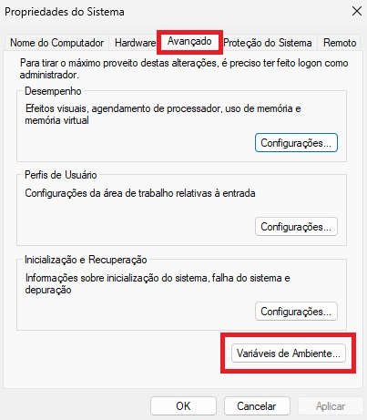
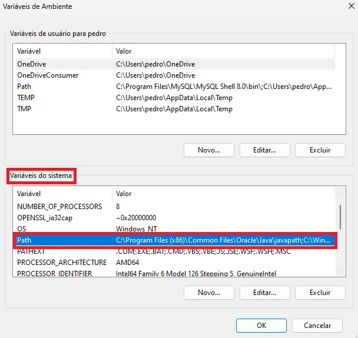
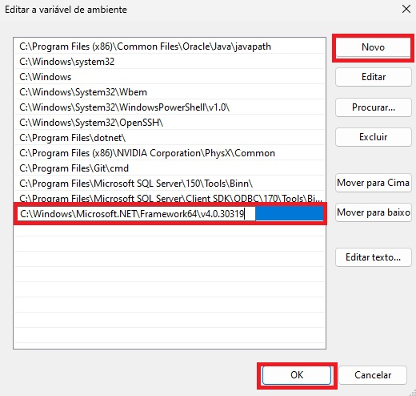

# INSTALANDO PROGRAMAS E RECURSOS

## Primeira mente abra o seu Prompt de Comando:
Use o atalho **"Win + R"** e digite **"cmd"** e pressione **"Enter"**:


Agora com o Prompt de Comando aberto pesquise pelo executavel para ver se já encontrasse instalado:
````
>>> csc
````


Se não estiver intalado o executavel, como na imagem a cima. Faça os seguintes passos:

## Instalar o DotNet
- Instalar o <a href="https://dotnet.microsoft.com/pt-br/download" targer="_blanc">DotNet</a>;


## Instalar o Visual Studio Code
- Instalar o <a href="https://code.visualstudio.com/download" targer="_blanc">Visual Studio Code</a>;


#
- Já dentro do **Visual Studio Code** na aba de **extensões** pesquise por **C#** e instale;


## Instalar o Visual Studio Community
- Instalar o <a href="https://visualstudio.microsoft.com/pt-br/downloads/" targer="_blanc">Visual Studio Community</a>


## Intalação do Path CSC no Windows
Após concluir todas as instalações de progrmas e recursos, vamos para a instalação do Path CSC no Windows:

- Pesquise na busca do windows por **"variáveis"** e selecione a opção **"Editar as variáveis de ambiente do sistema"** como segue na imagem a seguir:


##

- Irá abrir uma janela de **"Propriedade do Sistema"**, vá para a aba **"Avançado"** e clique na opção **"Variáveis de Ambiete"**:



##

- Uma nova janela se abrirá. Na área de **"Varáveis do Sistema"**, procure por **"Path"** e clique duas vezes:



##

- Agora abra seu **"Explorador de Arquivos"** para ir até a pasta em que se encontra nosso compilador **"csc.exe"**, e copie o caminho, que geralmente é padrão como vem a seguir:
````
>>> C:\Windows\Microsoft.NET\Framework64\v4.0.30319
````


##

- Volte para a janela que foi aberta quando clicamos na opção **"Path"**, clique em **"Novo"**, e cole o **"caminho da pasta"**:



##

- **"Reinicie o computador"** e pronto para começar.